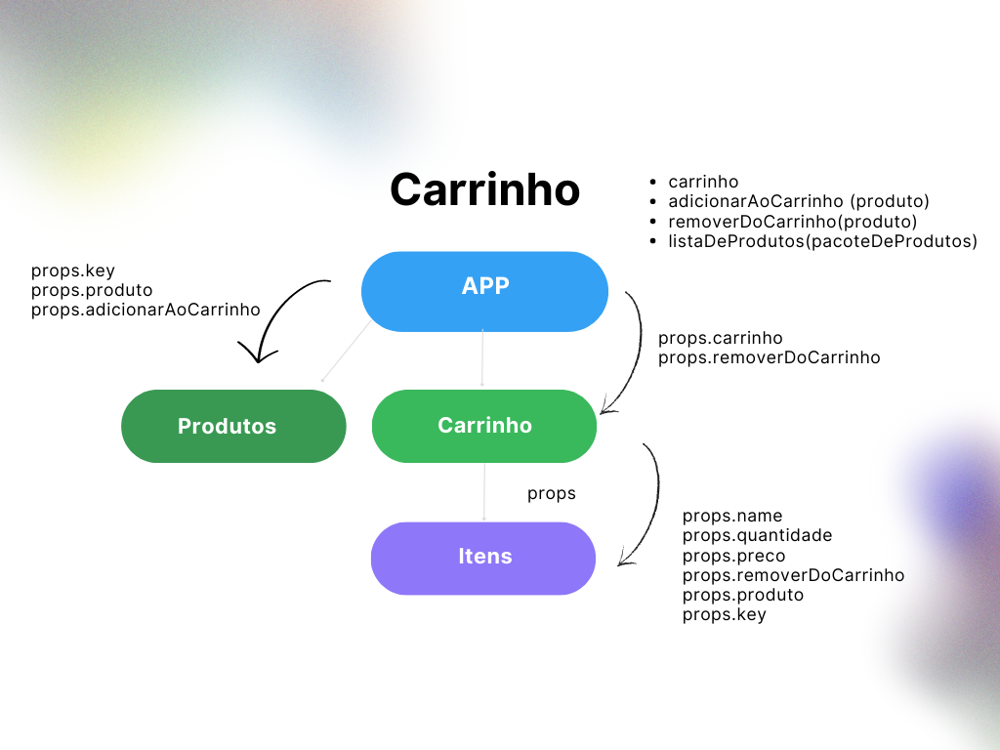

# Atividade Carrinho

Este é um arquivo README para a atividade "Carrinho". Nesta atividade, vamos treinar a construção de um carrinho simples.

## Descrição da Atividade

A atividade consiste em observar o fluxo de dados do template fornecido e responder, de forma retórica, as seguintes questões:

- Qual o componente que provê as informações para os componentes consumidores?
- Todos os estados estão no componente provedor?
- As funções para adicionar ou remover um produto estão em qual componente?
- Você consegue explicar como está funcionando o fluxo dos dados dessa aplicação?

## Imagem do Fluxo de Dados

## Instruc"es

Clone este repositório para a sua máquina local

Abra o arquivo carrinho.js para visualizar o código relacionado ao carrinho.

Observe a imagem do fluxo de dados para entender como as informações são transmitidas entre os componentes.

Responda às questões propostas, considerando o fluxo de dados da aplicação.

Realize as modificações ou melhorias necessárias no código, se for o caso.
